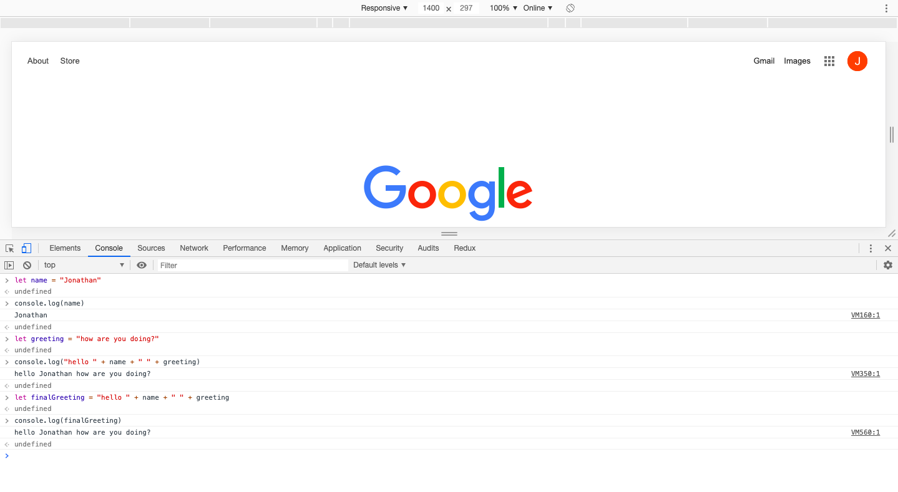
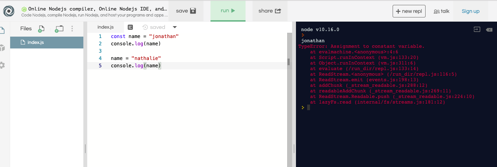

# JavaScript
## Objectives
* overview of web browser and Node.js(commandLine)
* data types and variables
* practicing declaring variables and printing them to the console (hands on)

      JavaScript… it can run on the web browser, or run through the terminal by using Node.js :computer: 


## Web browser console vs Node.js
 Before starting, each browser has its own compiler that reads JavaScript code. A well known one is chrome and its compiler called the “V8 engine”. Other compilers are used for different web browsers such as firefox using “SpiderMonkey”. More info [here](https://blog.sessionstack.com/how-javascript-works-inside-the-v8-engine-5-tips-on-how-to-write-optimized-code-ac089e62b12e)

Chrome’s V8 engine turns JavaScript into computer readable language. It takes the instructions created and turns it into a language the computer can understands and follows instructions to create whatever was instructed. 

The v8 engine was then taken out of the browser and was then created to run locally on your computer. This is Node.js. It was created using C++. It turns javascript code into computer c++ and then to instructions that computers can understand to execute your instructions correctly.


## Web browser console example (Chrome)
___


      Google Chrome console to declare variables and print them to the console
___
## Node.js example (The terminal)
___


      Using a text editor and node.js to declare variables and print them to the console
___


# Data types and variables
      goals for this section:
* understand let and const
* understand good variable name declarations
* how to use console log
* understand what are data types

1. let/const and variables

Variables are like an empty box. You are able to assign data into them. They can either be a string or number. Variables are dynamically typed. They can start off as a number, and be changed into a string without any issues

```javascript
let item1 = "the string"
      // item1 variable now has the data type string assigned to it
```

example of changing the variable to another data type

```javascript
console.log(item1)
// will print out the current value that was assigned to the variable. which is "the string"

item1 = 9000
console.log(item1)
// this will print out a number 9000
```

variables can be reassigned data of any data type. This is an example of using let keyword. This cannot be done using const. Once the variable has been set, the value cannot be overWritten. It will throw an error

example of const

```javascript
const name = "jonathan"
console.log(name)
// will print out the string "jonathan"

name = "nathalie"
// will throw an error
``` 


const cannot be reassigned a new piece of data. This is good to use for variables that should not be changed such as a math formula. example would be like "pi". Changing the value of pi would lead to funny math calculations.

For this lesson we will be using string and numbers data types. Here is a list of other data types used by JavaScript


## More info on data types
___

* number for numbers of any kind: integer or floating-point.

```javascript
let numberValue = 9000
```

* string for strings. A string may have one or more characters, there’s no separate single-character type.

```javascript
let str = "this is a string"
```

* boolean for true/false. Values can only be either true or false.

```javascript
let trueValue = true
let falseValue = false
```

* null for unknown values – a standalone type that has a single value null. the Data is null and can be reassigned a different data type.

```javascript
let nullValue = null
```

* undefined for unassigned values – a standalone type that has a single value undefined.

```javascipt
let undefValue = undefined
```
___


2. good variables names and standards


